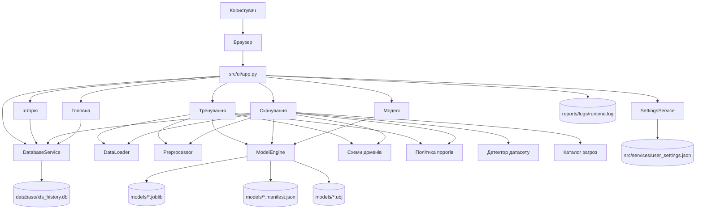
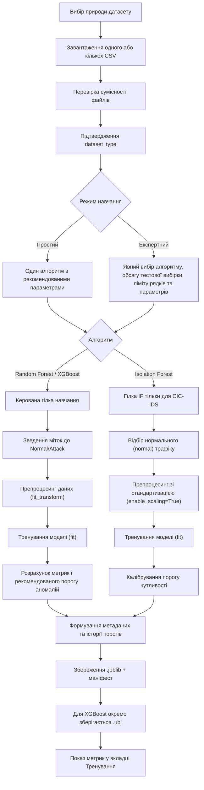
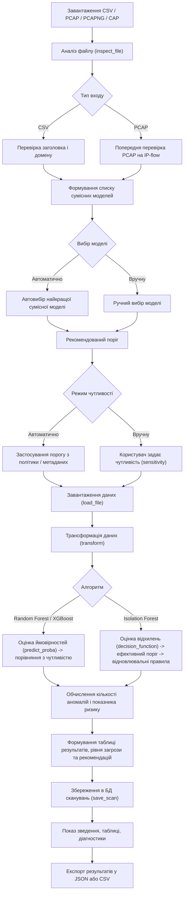
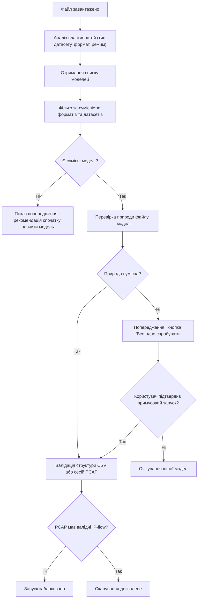
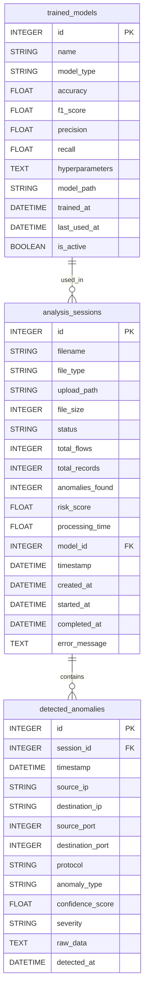
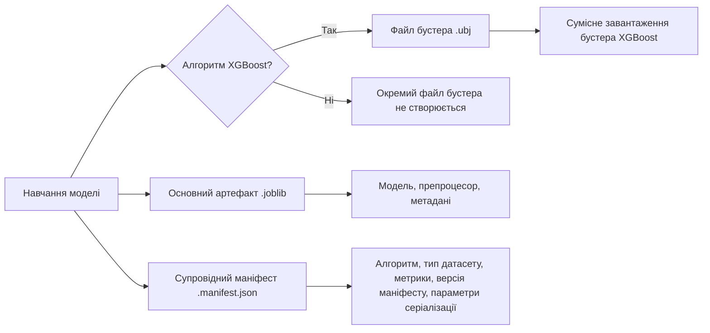
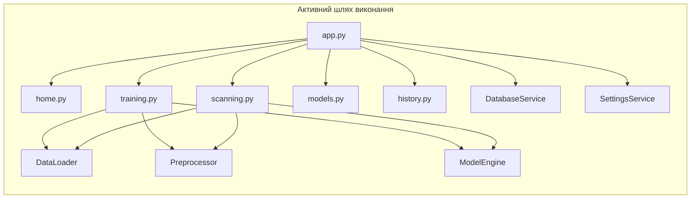
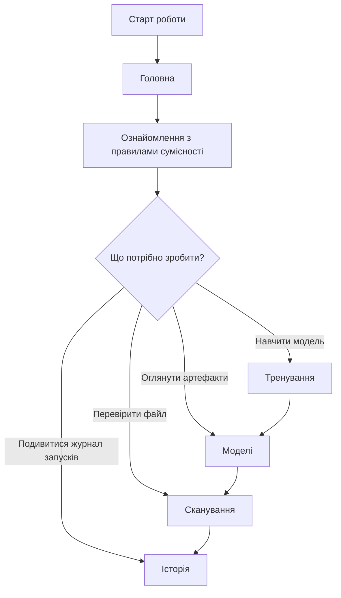

# IDS ML Analyzer - схеми та діаграми

## 1. Примітка до схем

Наведені діаграми відображають саме поточний активний потік виконання проєкту, за файлами:

- `src/ui/app.py`
- `src/ui/tabs/training.py`
- `src/ui/tabs/scanning.py`
- `src/core/data_loader.py`
- `src/core/preprocessor.py`
- `src/core/model_engine.py`
- `src/core/threshold_policy.py`
- `src/database/models.py`

## 2. Загальна архітектура поточного шляху виконання

## 3. Активний конвеєр навчання

## 4. Активний конвеєр сканування

## 5. Схема прийняття рішення про сумісність

## 6. ER-діаграма бази даних

## 7. Схема артефактів моделі

## 8. Активні модулі

## 9. Навігаційний сценарій користувача

## 10. Позначення до діаграм

| Діаграма | Що відображає |
|---|---|
| 2 | Загальна архітектура: вкладки, сервіси, модулі ядра та артефакти |
| 3 | Конвеєр навчання моделі від вибору датасету до збереження артефактів |
| 4 | Конвеєр сканування від завантаження файлу до експорту результатів |
| 5 | Логіка перевірки сумісності файлу з моделлю |
| 6 | ORM-схема SQLite (3 таблиці: `analysis_sessions`, `detected_anomalies`, `trained_models`) |
| 7 | Структура артефактів навченої моделі |
| 8 | Активні модулі проєкту та зв'язки між ними |
| 9 | Типовий сценарій навігації користувача |
