# IDS ML Analyzer — Схеми для дипломної роботи

> **Версія:** 1.0 | **Дата:** квітень 2026 | **Формат діаграм:** Mermaid (рендеруються у GitHub, VSCode, Obsidian)

---

## Змiст

1. [Загальна архітектура системи](#1-загальна-архітектура-системи)
2. [Рівнева діаграма компонентів](#2-рівнева-діаграма-компонентів)
3. [Схема бази даних (ER-діаграма)](#3-схема-бази-даних-er-діаграма)
4. [Конвеєр навчання моделі](#4-конвеєр-навчання-моделі)
5. [Конвеєр сканування (аналізу)](#5-конвеєр-сканування-аналізу)
6. [Архітектура двоетапної моделі](#6-архітектура-двоетапної-моделі)
7. [Математична модель TwoStageModel](#7-математична-модель-twostagemodel)
8. [Алгоритм сумісності файл/модель](#8-алгоритм-сумісності-файлмодель)
9. [Навігація інтерфейсу](#9-навігація-інтерфейсу)
10. [Порівняння алгоритмів ML](#10-порівняння-алгоритмів-ml)
11. [Схема захисту від XSS](#11-схема-захисту-від-xss)
12. [Граф залежностей модулів](#12-граф-залежностей-модулів)

---

## 1. Загальна архітектура системи

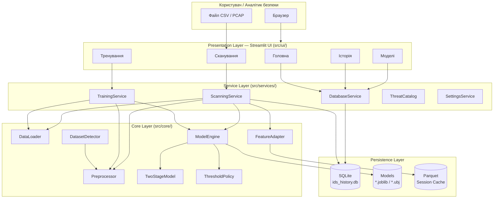

---

## 2. Рівнева діаграма компонентів

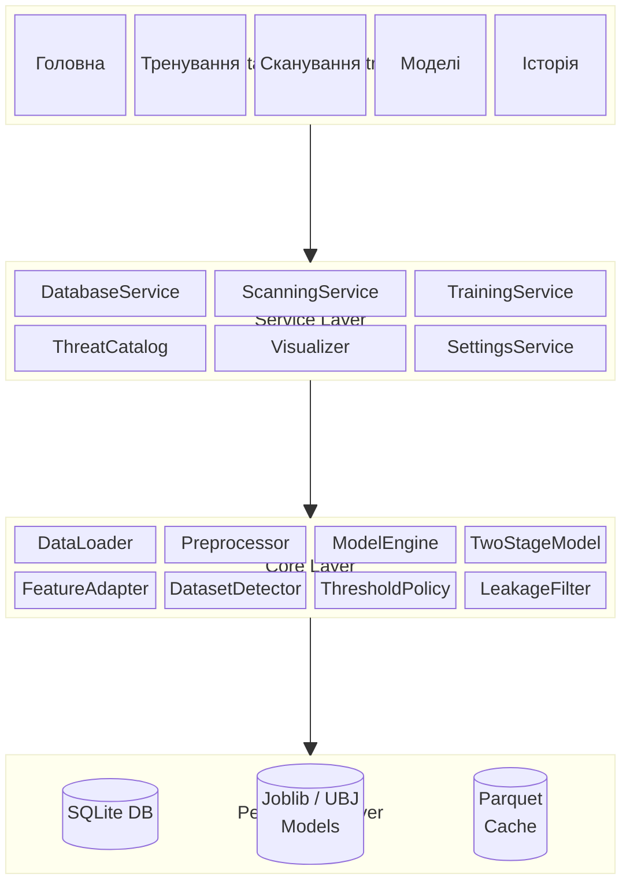

---

## 3. Схема бази даних (ER-діаграма)

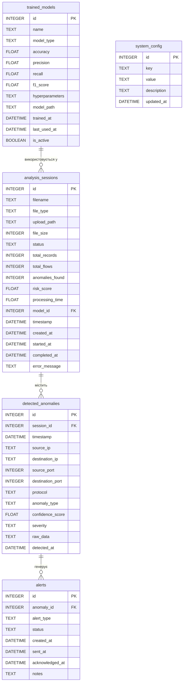

---

## 4. Конвеєр навчання моделі

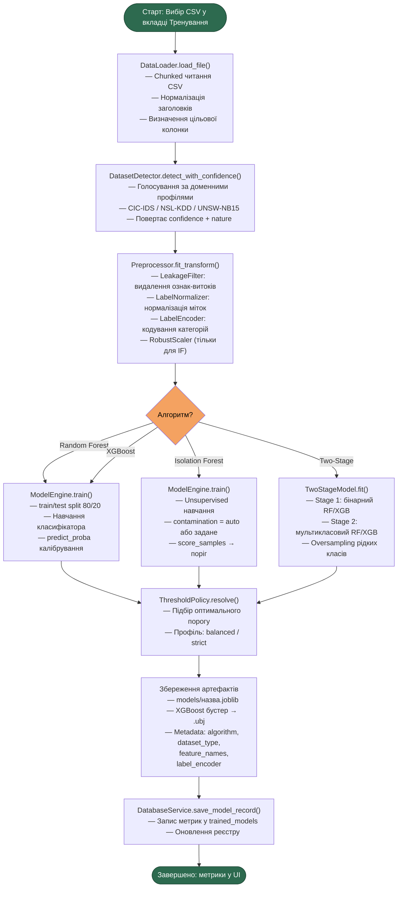

---

## 5. Конвеєр сканування (аналізу)

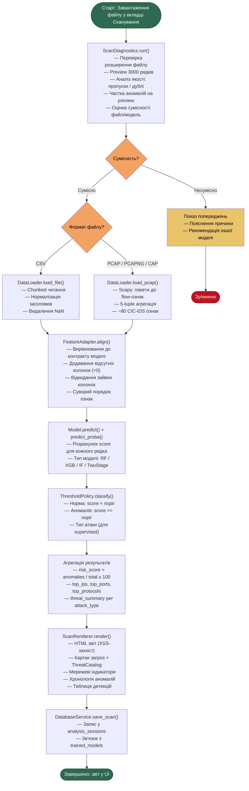

---

## 6. Архітектура двоетапної моделі

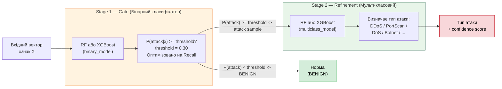

---

## 7. Математична модель TwoStageModel

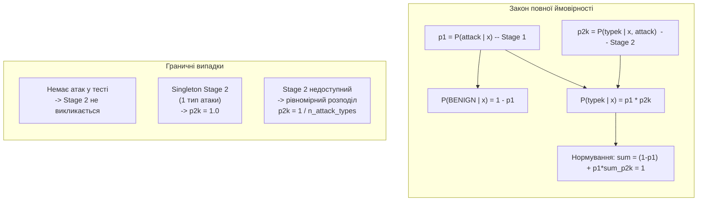

---

## 8. Алгоритм сумісності файл/модель

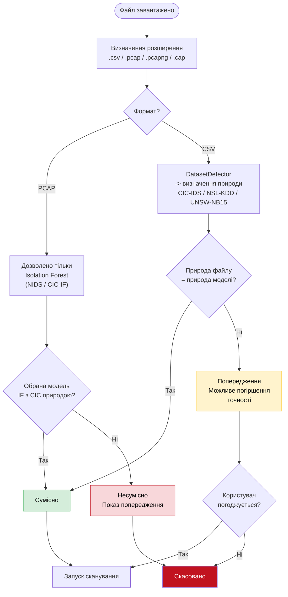

---

## 9. Навігація інтерфейсу

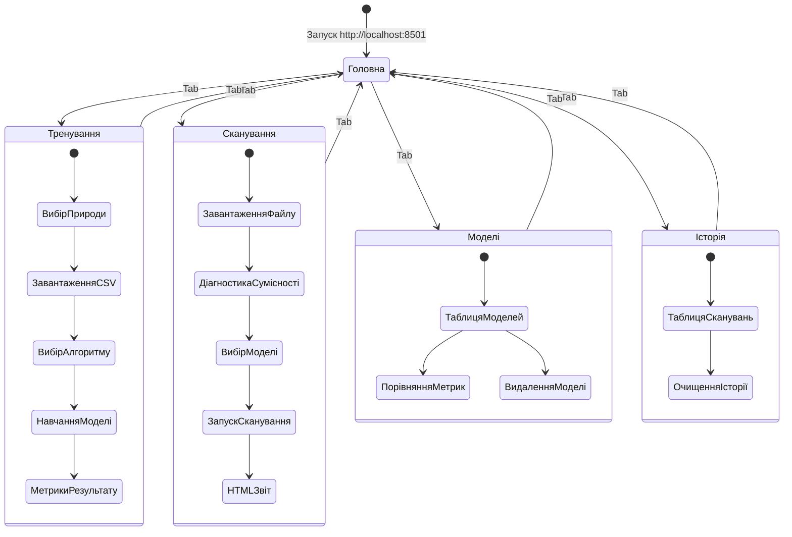

---

## 10. Порівняння алгоритмів ML

> Примітка: до порівняння включено лише алгоритми, реалізовані в `ModelEngine` та доступні через UI.

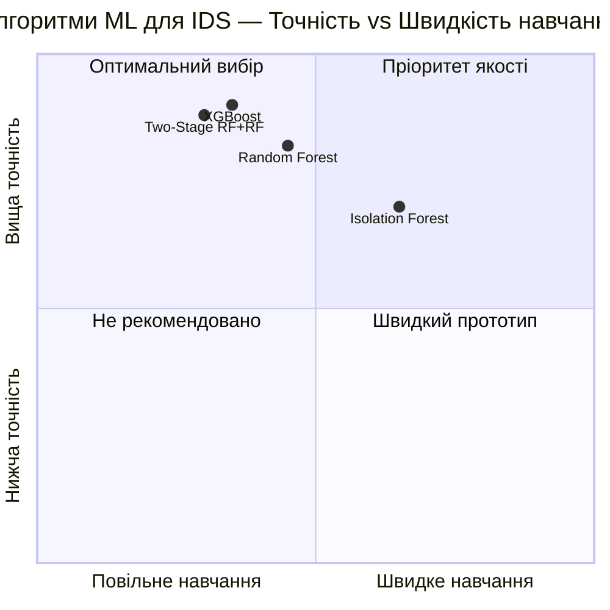

---

## 11. Схема захисту від XSS

```mermaid
sequenceDiagram
    participant F as CSV/PCAP файл
    participant SVC as ScanningService
    participant RND as ScanRenderer
    participant ESC as escape_html()
    participant UI as Streamlit UI

    F->>SVC: Завантаження даних (src_ip, anomaly_type, raw_data)
    SVC->>SVC: Агрегація результатів
    SVC->>RND: render(results_dict)

    Note over RND,ESC: Кожен рядок з даних користувача
    RND->>ESC: escape_html(src_ip)
    ESC-->>RND: script -> &lt;script&gt; (екранований)
    RND->>ESC: escape_html(anomaly_type)
    ESC-->>RND: безпечний рядок
    RND->>ESC: escape_html(raw_data_field)
    ESC-->>RND: безпечний рядок

    RND->>UI: st.markdown(safe_html, unsafe_allow_html=True)
    UI->>UI: Відображення без виконання скриптів
```

---

## 12. Граф залежностей модулів

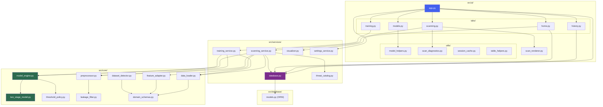

---

*Усі діаграми побудовані на основі актуального вихідного коду проекту. Дата генерації: квітень 2026.*
