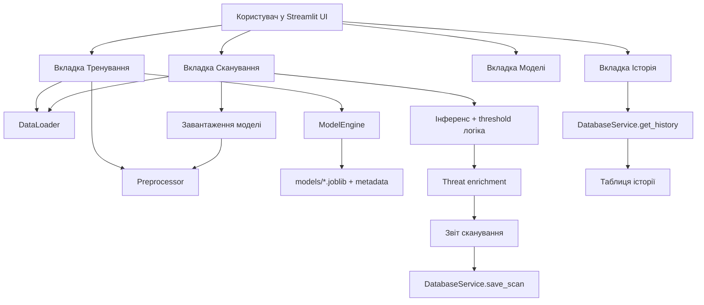
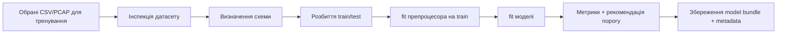
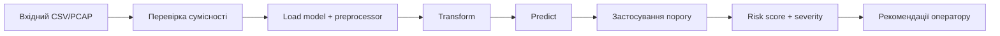

# Діаграми системи

## 1) Активний runtime-потік

```mermaid
flowchart TD
    A[Користувач у Streamlit UI] --> B[Вкладка Тренування]
    A --> C[Вкладка Сканування]
    A --> D[Вкладка Моделі]
    A --> E[Вкладка Історія]

    B --> F[DataLoader]
    B --> G[Preprocessor]
    B --> H[ModelEngine]
    H --> I[models/*.joblib + metadata]

    C --> J[Завантаження моделі]
    J --> G
    C --> F
    C --> K[Інференс + threshold логіка]
    K --> L[Threat enrichment]
    L --> M[Звіт сканування]
    M --> N[DatabaseService.save_scan]

    E --> O[DatabaseService.get_history]
    O --> P[Таблиця історії]
```

## 2) Потік навчання

```mermaid
flowchart LR
    A[Обрані CSV/PCAP для тренування] --> B[Інспекція датасету]
    B --> C[Визначення схеми]
    C --> D[Розбиття train/test]
    D --> E[fit препроцесора на train]
    E --> F[fit моделі]
    F --> G[Метрики + рекомендація порогу]
    G --> H[Збереження model bundle + metadata]
```

## 3) Потік сканування

```mermaid
flowchart LR
    A[Вхідний CSV/PCAP] --> B[Перевірка сумісності]
    B --> C[Load model + preprocessor]
    C --> D[Transform]
    D --> E[Predict]
    E --> F[Застосування порогу]
    F --> G[Risk score + severity]
    G --> H[Рекомендації оператору]
```
